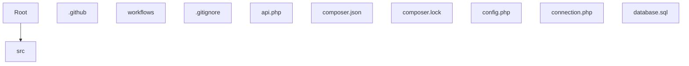

# 🚀 chat-app

**[EN]** chat-app project

**[ID]** chat-app project

---

[]()
[]()
[]()
[]()


---

## ✨ Features / Fitur

> **[EN]** Key features of this project.

> **[ID]** Fitur utama dari project ini.

<!-- Add your features here: -->
- Feature 1
- Feature 2

---

## 🏗️ Architecture / Arsitektur

**[EN]** Project structure overview.

**[ID]** Ikhtisar struktur project.

``
.github/
  workflows/
.gitignore
api.php
composer.json
composer.lock
config.php
connection.php
database.sql
env.php
icon.svg
index.php
logo.png
logout.php
manifest.json
README.md
sw.js
``



---

## 🛠️ Tech Stack

| Component | Purpose |
|-----------|---------|
| PHP | Runtime |


---

## 🚀 Quick Start

### Prerequisites

* [](https://git-scm.com/)

* [](https://www.php.net/)

### Installation / Instalasi

```bash
# Clone
git clone https://github.com/GrayZeus20/chat-app.git
cd chat-app

# Install dependencies / Install dependensi
composer install
```

### Development / Pengembangan

```bash
# Start dev server / Jalankan server development
# See scripts in package.json or composer.json
```

### Build

```bash
# No build step
```

### Testing / Pengujian

```bash
# Add test script
```

---

## ⚙️ Configuration / Konfigurasi

**[EN]**

Configure config.php or .env with your settings:

**[ID]**

Konfigurasikan config.php atau .env dengan pengaturan Anda:

```bash

# Edit config.php or .env file
```

---

## 📜 Available Commands / Perintah Tersedia


---

## 📚 Documentation / Dokumentasi

<!-- Add documentation links here -->

---

## 🕒 Recent Changes / Perubahan Terbaru

* Update sidebar logo to SVG format and increase size
* Update logo size in auth section and replace sidebar logo with icon
* logo lagi
* ganti logo auth section
* Enhance viewport meta tag for improved mobile responsiveness
* Enhance user list interaction by disabling text selection and context menu
* Refactor code structure for improved readability and maintainability
* Refactor message action positioning for improved layout consistency in chat interface

---

## 🛡️ Security / Keamanan

**[EN]**
* API keys and secrets are never committed to Git.
* All .env files are git-ignored.
* Only .env.example with placeholder values is tracked.

**[ID]**
* API key dan rahasia tidak pernah di-commit ke Git.
* Semua file .env di-gitignore.
* Hanya .env.example dengan nilai placeholder yang di-track.

---

## 🤝 Contributing / Kontribusi

1. Fork this repository
2. Create a feature branch (git checkout -b feature/amazing-feature)
3. Commit your changes (git commit -m 'Add amazing feature')
4. Push to the branch (git push origin feature/amazing-feature)
5. Open a Pull Request

---

## 👤 Author / Pengembang

Dandi January

---

## 📄 License / Lisensi

MIT © 2026
